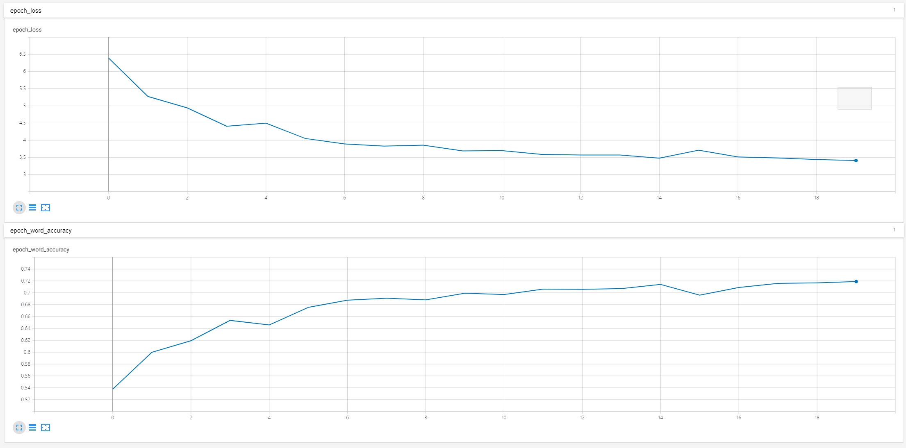

****CRNN implementation using tensorflow2.2.0****
=============================

****一个基于tensorflow2.2.0的CRNN不定长中文字符序列识别模型****
```
项目详细介绍可参见：https://www.jianshu.com/p/e0d9efaadb0f
凡对本项目有任何疑惑可加QQ群交流：1081332609
```
# 一、数据准备

## 训练数据集链接
下载后解压至./dataset/train/中。

```
链接：https://pan.baidu.com/s/1FgdITVrM_HsyNh7QSpePjw 
提取码：iakr
解压密码:chineseocr
```

## 模型结果文件链接

下载后解压至./output/中


```
链接：https://pan.baidu.com/s/1OUwcUNJo8ZEcAExiQtjExQ 
提取码：lbfr
```

# 二、模型训练

## 环境配置
### 1、请先配置好自己的tensorflow环境
CPU版本：请自行修改requirements.txt中Tensorflow版本信息即可
GPU版本：需先自行配置好Tensorflow-GPU环境
### 2、pip安装
```
pip install -i http://mirrors.aliyun.com/pypi/simple/ --trusted-host mirrors.aliyun.com -r requirements.txt
```
### 3、修改项目路径

把./models/config.py中WORK_PATH的值替换为你自己的项目存放路径。

## 训练

### 1、运行train.ipynb即可开始训练

### 2、训练过程展示



## 测试

运行test.ipynb

# 三、服务部署

## Docker中tensorflow serving启动命令

### 1. CPU环境

```
docker run --name tfserving-crnn \
        --hostname tfserving-crnn \
        -tid \
        --restart=on-failure:10 \
        -p 7500:8500 \
        -p 7501:8501 \
        --mount type=bind,source=/root/python_project/crnn_by_tensorflow2.2.0/output,target=/models \
        -e MODEL_NAME=crnn \
        -t tensorflow/serving &
```

### 2. GPU环境

```
docker run --name tfserving-crnn-gpu \
        --hostname tfserving-crnn-gpu \
        -tid \
        --restart=on-failure:10 \
        --runtime=nvidia \
        -p 8500:8500 \
        -p 8501:8501 \
        --mount type=bind,source=/root/python_project/crnn_by_tensorflow2.2.0/output,target=/models \
        -e MODEL_NAME=crnn \
        -t tensorflow/serving:2.0.0-gpu &
```

### 3. 客户端

运行client.ipynb

## 三、效果展示


