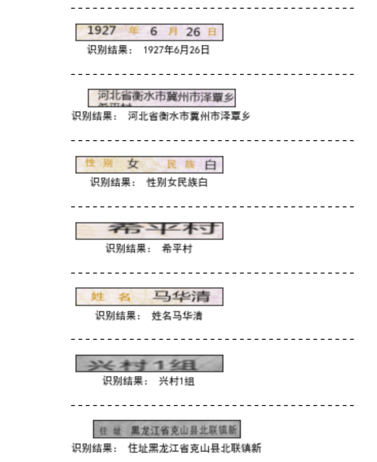
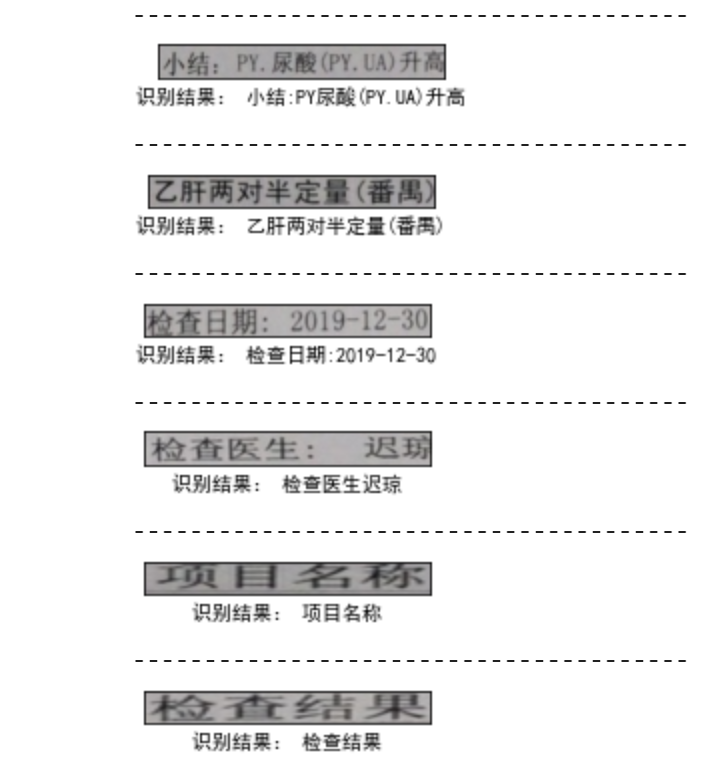

****crnn_by_tensorflow2.2.0****
=============================

****一个基于tensorflow2.2.0的CRNN不定长中文字符序列识别模型****
```
项目详细介绍可参见：https://www.jianshu.com/p/713ffa82b650
凡对本项目有任何疑惑可加QQ群交流：1081332609
```
# 一、数据准备

## 训练数据集链接
下载后解压至./dataset/train/中
```
链接：https://pan.baidu.com/s/1FgdITVrM_HsyNh7QSpePjw 
提取码：iakr
```

## 模型结果文件链接
下载后解压至./output/中

```
链接：https://pan.baidu.com/s/1ZVej4P099C--zNJd01cqhg 
提取码：6yar
```

# 二、模型训练

## 训练

运行train.ipynb

## 测试

运行test.ipynb

# 三、服务部署

### Docker中tensorflow serving启动命令

1. CPU环境

```
docker run --name tfserving-crnn \
        --hostname tfserving-crnn \
        -tid \
        --restart=on-failure:10 \
        -p 8500:8500 \
        -p 8501:8501 \
        --mount type=bind,source=/root/python_project/crnn_by_tensorflow2.2.0/output,target=/models \
        -e MODEL_NAME=crnn \
        -t tensorflow/serving &
```

2. GPU环境

```
docker run --name tfserving-crnn \
        --hostname tfserving-crnn \
        -tid \
        --restart=on-failure:10 \
        -p 8500:8500 \
        -p 8501:8501 \
        --mount type=bind,source=/root/python_project/crnn_by_tensorflow2.2.0/output,target=/models \
        -e MODEL_NAME=crnn \
        -t tensorflow/serving:latest-gpu &
```

3. 客户端

运行client.ipynb

## 三、效果展示


